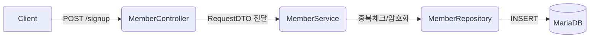

말씀하신 대로 Controller를 구성할 때 가장 깔끔한 구조는 **"기능별로 명확한 End-point(URL)를 나누는 것"**입니다.

보통 프로젝트에서 Member 컨트롤러와 서비스는 아래와 같은 큰 흐름으로 설계합니다. 

---

### 1. Controller 계층 (Interface)
컨트롤러는 사용자의 입력을 받고, 서비스의 결과를 어떤 HTTP 상태 코드(200, 400, 401 등)로 응답할지 결정합니다.

* **`POST /members/signup`**: 회원가입. (데이터를 생성하므로 POST)
* **`POST /members/login`**: 로그인. (보안상 ID/PW를 Body에 담아야 하므로 POST)
* **`POST /members/logout`**: 로그아웃. (서버의 세션을 무효화)
* **`GET /members/me`**: 내 정보 가져오기. (현재 로그인된 사용자의 프로필 조회)
* **`GET /members/check-id`**: 아이디 중복 체크. (가입 폼에서 실시간 확인용)

---

### 2. Service 계층 (Business Logic)
컨트롤러가 "무엇을 할지" 결정한다면, 서비스는 "어떻게 할지" 처리합니다.

* **`join()`**: 
    1. 중복 아이디가 있는지 Repository를 통해 확인.
    2. 비밀번호를 암호화(`BCrypt`).
    3. DB에 저장(`save`).
* **`login()`**: 
    1. 아이디로 DB에서 회원 조회.
    2. 입력된 비밀번호와 DB의 암호화된 비밀번호가 일치하는지 확인.
    3. 성공 시 유저 정보(DTO) 반환.
* **`updateProfile()`**: 
    1. 수정할 회원을 영속성 컨텍스트에 올림.
    2. 데이터 수정 (JPA의 더티 체킹 활용).

---

### 3. 전체적인 흐름 (시각화)

사용자가 회원가입 버튼을 누르는 순간부터 DB에 저장되기까지의 큰 구조입니다.

---

### 4. 작업하실 때 팁
개발 순서는 **안쪽에서 바깥쪽으로** 나오는 것이 편합니다.

1.  **Entity & Repository**: DB 테이블을 만들고 JPA 인터페이스 만들기.
2.  **DTO**: 회원가입 때 받을 데이터 객체(LoginId, Password, Nickname 등) 만들기.
3.  **Service**: 실제 회원가입 로직 짜기.
4.  **Controller**: PostMapping으로 API 열어주기.

이렇게 짜면 Member 파트의 80%는 끝납니다. 혹시 지금 바로 **Entity(테이블 설계)**부터 같이 코드로 짜볼까요? 아니면 **DTO**에 어떤 값을 넣을지부터 정해볼까요?